# Bookmark Brain 🧠

A personalized semantic search engine for your X (Twitter) bookmarks. Search through your bookmarks using natural language and get contextually relevant results.

<div align="center">
  
</div>

```tsx
// Animated bookmark icon
export function BookmarkIcon() {
  return (
    <svg 
      xmlns="http://www.w3.org/2000/svg" 
      viewBox="0 0 24 32" 
      className="w-24 h-32"
    >
      <path 
        className="stroke-white fill-none stroke-[1.5] animate-[drawBookmark_1.5s_ease-in-out_infinite_alternate]"
        d="M4 2 L4 30 L12 24 L20 30 L20 2 Q20 1 19 1 L5 1 Q4 1 4 2 Z"
      />
    </svg>
  )
}
```

## Setup

1. Create and activate virtual environment:
```bash
python -m venv venv
source venv/bin/activate  # Unix
.\venv\Scripts\activate   # Windows
```

2. Install requirements:
```bash
pip install -r requirements.txt
```

3. Scrape your bookmarks:
```bash
python scrape_bookmarks.py
```

> **Note**: If you have X API Premium access, you can alternatively use:
> ```bash
> python twitter_bookmarks.py
> ```

This will create a `bookmarks.json` file:
```json
{
  "id": "1803461399286522122",
  "text": "Big step for Generative 3D:\nMeshAnything...",
  "author": "Troy Kirwin\n@tkexpress11",
  "timestamp": "2024-06-19T16:14:38.000Z",
  "images": ["https://pbs.twimg.com/media/GQcubFoaIAQJS1u?format=jpg&name=large"],
  "links": ["https://x.com/tkexpress11/status/1803461399286522122"]
}
```

4. Process the data:
```bash
python process_json.py
```

This creates `data.json` with cleaned format:
```json
{
  "id": "1802376838427394060",
  "text": ". @raffi_hotter and I ran a 2-week hackathon...",
  "timestamp": "2024-06-16T16:24:59.000Z",
  "images": ["https://pbs.twimg.com/media/GQNPJZCaMAAvbMO?format=jpg&name=large"],
  "links": ["https://x.com/raffi_hotter"],
  "link_to_post": "https://twitter.com/i/web/status/1802376838427394060",
  "author_name": "marley",
  "author_handle": "@_marleyx"
}
```

5. Process with NER and generate embeddings:
```bash
python ner.py
```

This creates `processed_chunks.json` with NER entities and embeddings:
```json
{
  "id": "1863261954229321873_chunk_5625",
  "text": "Prompt with example output from Flux Dev. Fast, Good, and cheap.",
  "context": {
    "original_id": "1863261954229321873",
    "author_name": "Ethan Woo",
    "author_handle": "@EthanWoo",
    "entities": {
      "ORG": [{"text": "Flux Dev", "start": 32, "end": 40}],
      "PERSON": [{"text": "Good", "start": 48, "end": 52}],
      "TECH": []
    },
    "has_images": true,
    "has_links": true
  }
}
```
> Note: Embeddings are omitted from the example as they are large vector arrays.

6. Setup PostgreSQL Database:
Follow the [Supabase Hybrid Search Guide](https://supabase.com/docs/guides/ai/hybrid-search) to:
- Create tables with vector columns
- Setup indexes for full-text and semantic search
- Implement the hybrid search function 

7. Run the Next.js app (make sure to put in the required .env variables):
```bash
pnpm install
pnpm dev
```

Open [http://localhost:3000](http://localhost:3000) to view the app.

## Architecture

```mermaid
flowchart LR
    %% Data Collection & Processing (Vertical subgraph)
    subgraph Pipeline
        direction TB
        X[(X Platform)]
        scrape[scrape_bookmarks.py]
        process[process_json.py]
        ner[ner.py]
        embed[Embeddings<br>ada-002]
        X --> scrape
        scrape --> process
        process --> ner
        ner --> embed
    end
    
    %% Client Interaction (Horizontal)
    user([User]) --> next[Next.js App]
    next --> user
    
    subgraph Supabase PostgreSQL
        direction LR
        db[(Database)]
        conv[(Conversation<br>Storage)]
    end
    
    %% Database Connections
    embed --> db
    next --> db
    db --> search[Hybrid Search]
    search --> context[Retrieved Context]
    next --> conv
    conv --> next
    conv --> llm
    
    %% LLM Processing
    context --> llm[LLM]
    next --> llm
    llm --> next
    
    %% Apply bold style to all nodes
    style X fill:#fff,stroke:#333,color:#000,font-weight:bold
    style scrape fill:#fff,stroke:#333,color:#000,font-weight:bold
    style process fill:#fff,stroke:#333,color:#000,font-weight:bold
    style ner fill:#fff,stroke:#333,color:#000,font-weight:bold
    style embed fill:#fff,stroke:#333,color:#000,font-weight:bold
    style user fill:#fff,stroke:#333,color:#000,font-weight:bold
    style next fill:#f9f9f9,stroke:#333,color:#000,font-weight:bold
    style search fill:#fff,stroke:#333,color:#000,font-weight:bold
    style Supabase PostgreSQL fill:#3ECF8E,stroke:#333,color:#000,font-weight:bold
    style db fill:#fff,stroke:#333,color:#000,font-weight:bold
    style conv fill:#fff,stroke:#333,color:#000,font-weight:bold
    style context fill:#fff,stroke:#333,color:#000,font-weight:bold
    style llm fill:#ff9999,stroke:#333,color:#000,font-weight:bold
    style Pipeline fill:#f5f5f5,stroke:#333,color:#000,font-weight:bold
```



### Data Preprocessing
I used a custom dataset of my X bookmarks. I have 286 bookmarks, and scraped them from X and added additional NER entities to it.
The Python pipeline handles data collection and preprocessing:
- `scrape_bookmarks.py`: Scrapes X bookmarks using Selenium
- `process_json.py`: Cleans and structures the data
- `ner.py`: Custom NER pipeline for entity extraction and embedding. <b>It has a custom contextual chunker that chunks data based on context to create better embeddings.</b>
Note: I initially used all-mpnet-base-v2 for embeddings, but could not get transformers.js working to embed my query, so I used ada-002 for embeddings everywhere instead.

### Why No Vector Database?
Following [this article](https://t.co/Kr4h6YByff) (and my experiences with RAG at Eli Lilly), I've found that vector databases tend to seperate your actual data with embeddings, and make it difficult to synchronize. Instead, I've opted to use PostgreSQL with pgvector, treating embeddings as derived data through indexes.

### Custom Chat Interface
I've built my own chat interface. I took a lot of inspiration from Perplexity! The LLM answer format and sources cards were inspired by perplexity design. Creating an interface with streaming and minimal rerendering was time-consuming. 

### Link to X posts
All information generated is sourced from X posts, whose links are provided in sources cards.


